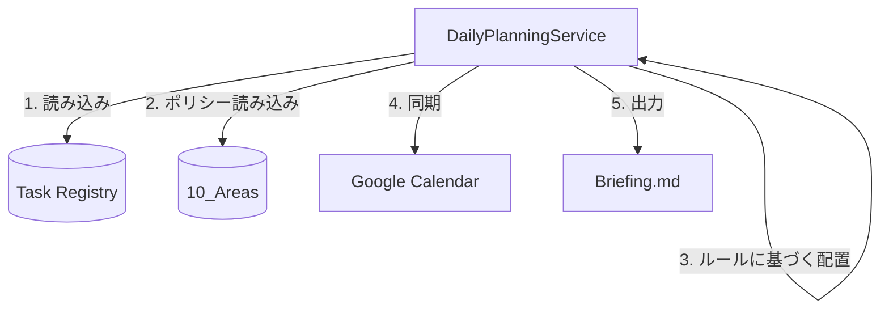

# Action & Reflection Pipeline

## 概要
本パッケージは、Epic 03「Action & Reflection Pipeline」の Application層（ユースケース）を実装します。
`DailyPlanningService` を中核とし、agent-coreから注入された依存関係（Task Registry, GCal Adapter）を用いて、日々のスケジューリング（棚卸し済みタスクの自動配置）とBriefing生成を担う「計算エンジン」として機能します。

## データフロー図

## アーキテクチャ上の責務
- 9つのスケジューリングルール（WIP制限、逆算思考、生体リズム等）を満たすパズルを解く。
- [W]割合不足などの異常があれば `warning_flag` を出力し、上位の `agent-core`（秘書スキル）に委譲する。
